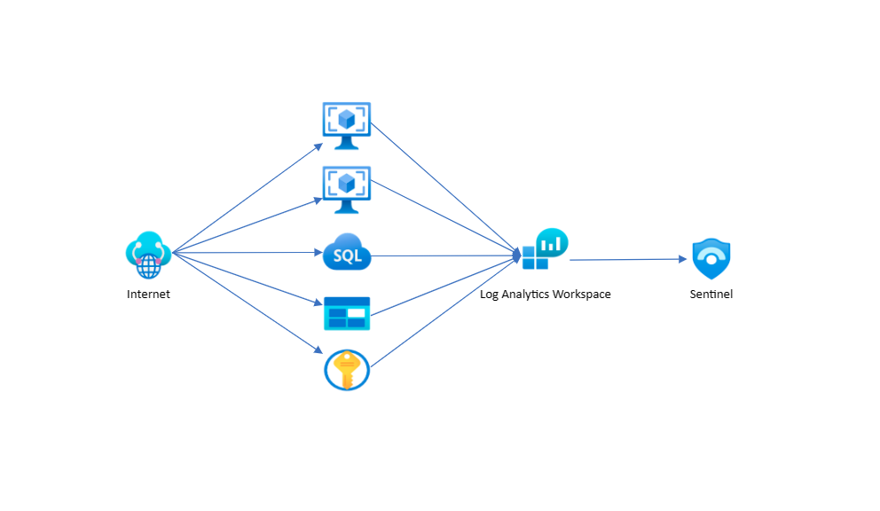
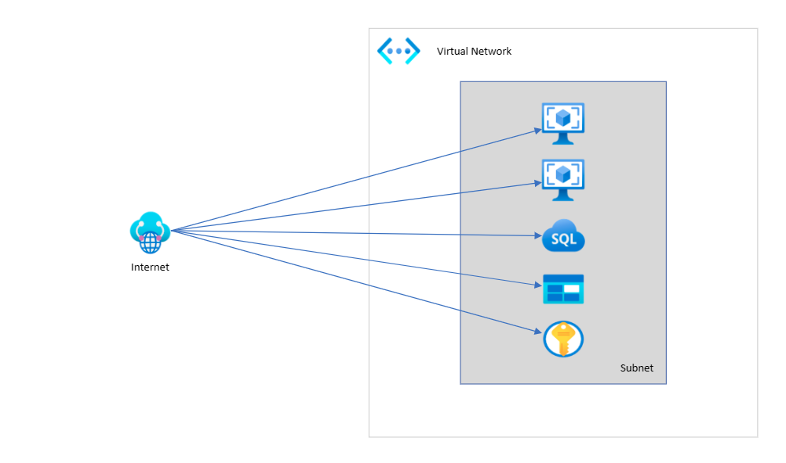
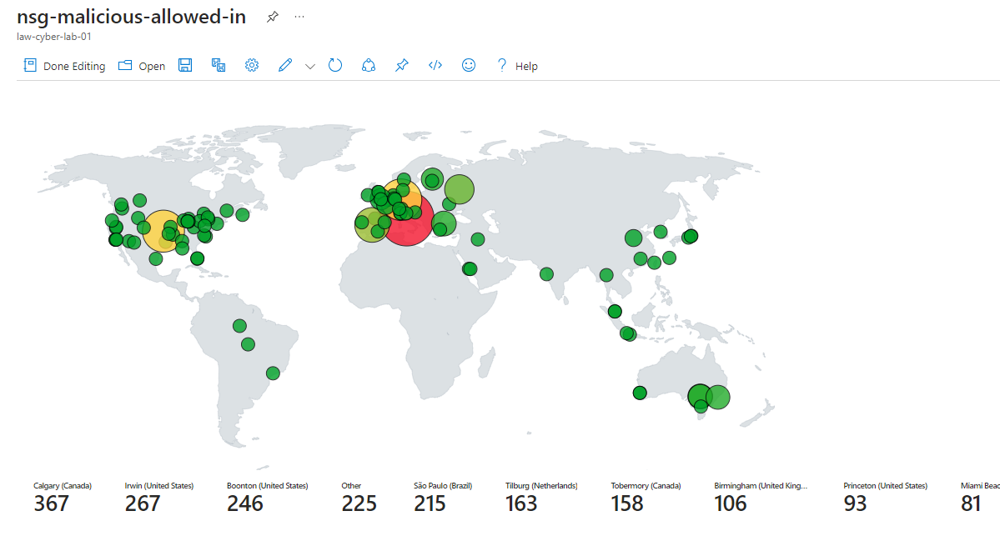
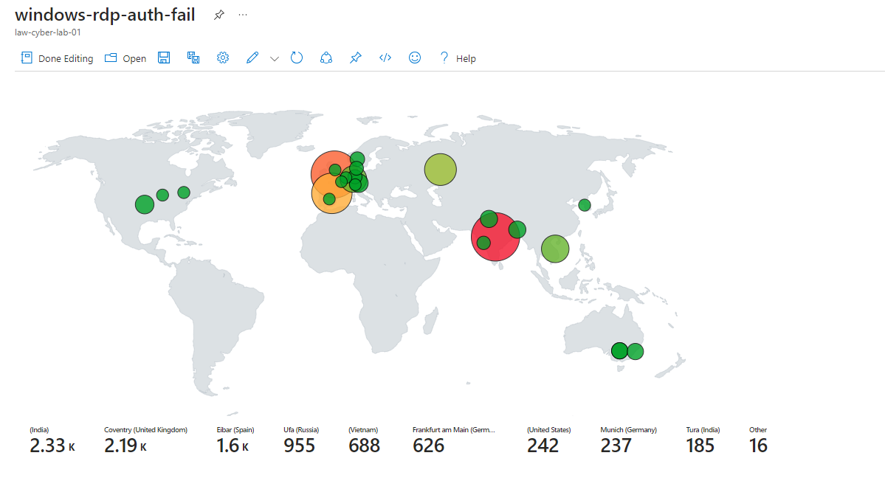
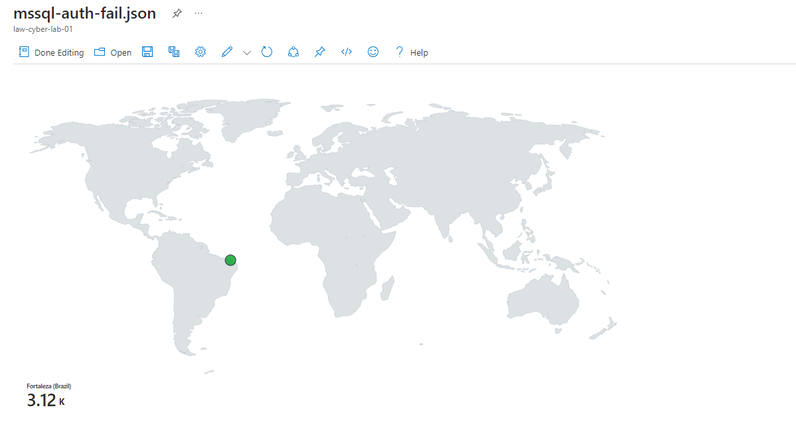
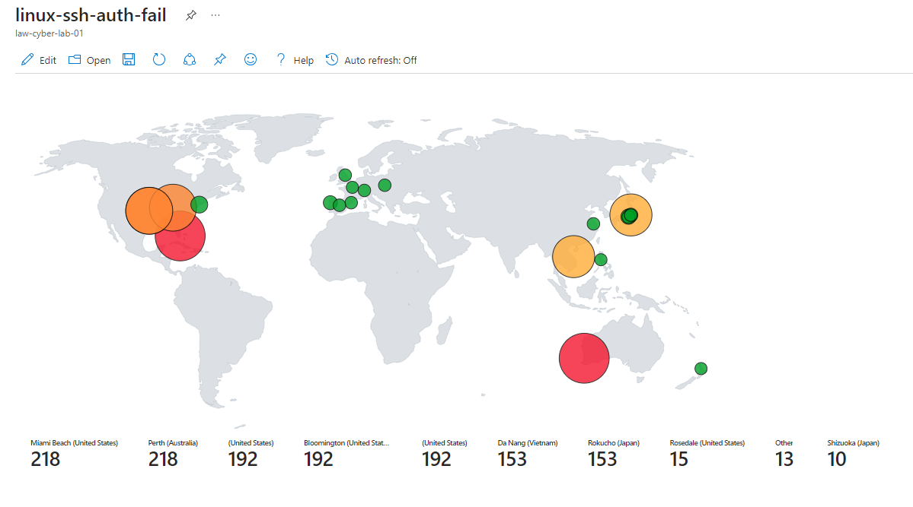
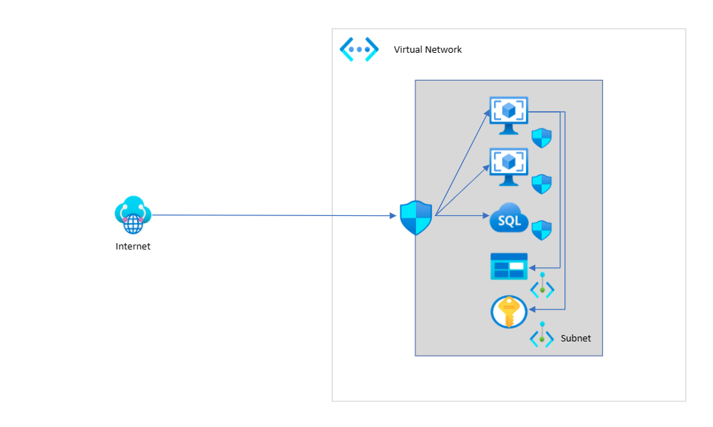

# SOC Simulation Using Azure Sentinel and Honeynet

## Introduction
In this project, I set up a cloud-based honeynet to gather real-world malicious network traffic. Then using Azure Sentinel, I simulated common Security Operations Center (SOC) processes like attack detection, incident response, and remidiation. After applying security controls recommended by NIST SP 800-53, I made a before and after comparison of the below security events to measure the effectiveness of the network hardening techniques. 

- SecurityEvent (Windows Event Logs)
- Syslog (Linux Event Logs)
- SecurityAlert (Log Analytics Alerts Triggered)
- SecurityIncident (Incidents created by Sentinel)
- AzureNetworkAnalytics_CL (Malicious Network Flows)

**Log Flow Visualization**

_Logs generated by security events are stored inside of Log Analytics. Sentinel then uses Kusto Query Language (KQL) to query and analyze these events:_

## Initial Network Topology

The honeynet consisted of the following components:
- 2x virtual machines 
  - 1x Windows 10 Pro with SQL Server 2019
  - 1x Linux (Ubuntu 20.04)
- 1x Storage Account
- 1x Key Vault

Both virtual machines were configured to allow all internet traffic. The Storage Account and Key Vault were also configured to be internet-facing.

The following table shows the relevant security events recorded from 2023-12-28 16:01:23 to 2023-12-29 16:01:23:

| Event                    | Occurance
| ------------------------ | -----
| SecurityEvent            | 48705
| Syslog                   | 1832
| SecurityAlert            | 4
| SecurityIncident         | 212
| AzureNetworkAnalytics_CL | 2927

## Attack Source
Using Sentinel Workbooks I created heat maps to visualize the geo-source of the attack traffic. 

_NSG Allowed Malicious Inbound Flows:_

_Windows RDP/SMB Authentication Failures:_

_MSSQL Authentication Failures:_

_Linux SSH Authentication Failures:_

## Security Controls
I configured Microsoft Defender for Cloud Regulatory Compliance to use NIST SP 800 53. Based on the recommendations, below are two of the controls implemented within the honeynet.

**Network Security Groups - NIST SP 800-53 (AC-4, SC-2, SC-7)**

Network Security Groups (NSGs) allow you to filter network traffic to and from endpoints based on prioritized security rules. For each rule, you can specify source/destination IP, port, and/or protocol to be allowed or denied. For example, you could specify that RDP (TCP 3389) be allowed only from a specific public IP. 

**Private Endpoints - NIST SP 800-53 (AC-4, SC-2, SC-7)**

Azure Private Endpoint (PE) is a service that allows you to assign a private IP to your network resource, restricting access to only other resources within your virtual network. For example, by enabling PE on your Azure Key Vault you could potentially enhance security by disabling public access completely.

## Ending Network Topology

The following table shows the relevant security events recorded from 2023-12-31 02:04:10 to 2023-01-01 02:04:10:
| Event                    | Occurance
| ------------------------ | -----
| SecurityEvent            | 8164
| Syslog                   | 1
| SecurityAlert            | 0
| SecurityIncident         | 0
| AzureNetworkAnalytics_CL | 0

## Conclusion
After applying just a few basic security controls recommended by NIST SP 800-53, I saw dramatic decreases in malicious activity within the honeynet. The below table highlights the effectiveness of these hardening techniques. 

| Event                    | Percent Change
| ------------------------ | -----
| SecurityEvent            | -83%
| Syslog                   | -99%
| SecurityAlert            | -100%
| SecurityIncident         | -100%
| AzureNetworkAnalytics_CL | -100%

